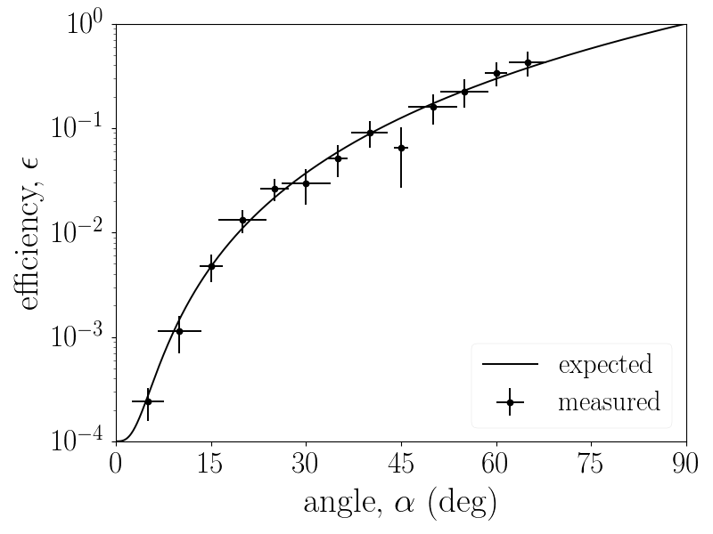

# L3 matplotlib style sheet
( **L**arge **L**atex **L**abels )

## Description

The L3 matplotlib style sheet provides figures with enlarged labels using the
default LaTeX fonts. It is meant for publication written with LaTeX, such that:

1. The figures labels are easy to read.
2. The text style in figures is consistent with the core paper's text.

## Examples



## Usage

In order to apply the style globally add the following lines to your python
file:

```Python
import matplotlib.pyplot as plt
plt.style.use("style/l3.mplstyle")
```
where the full path to [l3.mplstyle][l3] must be provided. Alternatively you
can also copy [l3.mplstyle][l3] to your `mpl_configdir/stylelib` folder, e.g.
`~/.config/matplotlib/stylelib` on Linux.

**Note** that temporary styling with a context manager doesn't seem to work
properly yet (as of matplotlib 2.1.0).

[l3]: style/l3.mplstyle
